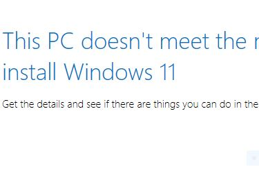

# Dev_Setup
Setup Development Environment

#Assignment: Setting Up Your Developer Environment

#Objective:
This assignment aims to familiarize you with the tools and configurations necessary to set up an efficient developer environment for software engineering projects. Completing this assignment will give you the skills required to set up a robust and productive workspace conducive to coding, debugging, version control, and collaboration.

#Tasks:

1. Select Your Operating System (OS):
   Choose an operating system that best suits your preferences and project requirements. Download and Install Windows 11. https://www.microsoft.com/software-download/windows11
     Here is a step-by-step procedure for installing Windows 11:

1. **Check System Requirements**: Before installing Windows 11, make sure your computer meets the minimum system requirements. These include a compatible processor, at least 4GB of RAM, 64GB of storage, and a DirectX 12 compatible graphics card.

2. **Backup Your Data**: It's always a good idea to back up your important files and data before installing a new operating system. You can use an external hard drive, cloud storage, or a backup software for this purpose.

3. **Download Windows 11**: You can download the Windows 11 installation files from the official Microsoft website. Make sure to download the correct version (Home, Pro, etc.) for your needs.

4. **Create Installation Media**: You can create a bootable USB drive or DVD with the Windows 11 installation files. You can use tools like Rufus or the Windows Media Creation Tool for this purpose.

5. **Boot from Installation Media**: Insert the bootable USB drive or DVD into your computer and restart it. You may need to change the boot order in the BIOS settings to boot from the installation media.

6. **Install Windows 11**: Follow the on-screen instructions to install Windows 11. You will need to select the language, time and currency format, and keyboard or input method. Then, choose the installation drive and follow the prompts to complete the installation.

7. **Set Up Windows 11**: Once the installation is complete, you will need to set up Windows 11 by creating a user account, choosing privacy settings, and customizing other preferences.

8. **Install Drivers and Updates**: After installing Windows 11, make sure to install the necessary drivers for your hardware components. You can download the latest drivers from the manufacturer's website. Also, check for Windows updates to ensure your system is up to date.

9. **Install Applications**: Finally, install your favorite applications and software on Windows 11 to customize it according to your needs.

10. **Enjoy Windows 11**: Once you have completed the installation and set up, you can start using Windows 11 and explore its new features and improvements.
  This is one of the chaallenges I experienced while installing windows 11 on my PC.
    

2. Install a Text Editor or Integrated Development Environment (IDE):
   Select and install a text editor or IDE suitable for your programming languages and workflow. Download and Install Visual Studio Code. https://code.visualstudio.com/Download
    Here is a step-by-step procedure for downloading and installing Visual Studio Code (VS Code):

1. **Download VS Code**:
   - Go to the official Visual Studio Code website at https://code.visualstudio.com/Download
   - Click on the "Download" button to download the installer for your operating system (Windows, macOS, or Linux).

2. **Install VS Code**:
   - Once the installer is downloaded, double-click on the downloaded file to start the installation process.
   - Follow the on-screen instructions in the installation wizard to install Visual Studio Code on your computer.
   - You may be prompted to choose installation options such as the installation directory and creating desktop shortcuts.

3. **Launch VS Code**:
   - After the installation is complete, launch Visual Studio Code by double-clicking on the desktop shortcut or searching for "Visual Studio Code" in the Start menu (Windows) or Applications folder (macOS).

4. **Explore VS Code**:
   - When you open Visual Studio Code, you will see the main interface with various panels and menus.
   - Take some time to explore the features and functionalities of VS Code, such as code editing, debugging, extensions, and settings.

5. **Install Extensions**:
   - Visual Studio Code supports a wide range of extensions that enhance its functionality for different programming languages and workflows.
   - Click on the Extensions icon in the Activity Bar on the side of the window to search for and install extensions that you find useful.

6. **Customize Settings**:
   - You can customize the settings in Visual Studio Code to tailor the editor to your preferences.
   - Access the Settings by clicking on the gear icon in the lower-left corner of the window or by pressing `Ctrl + ,` (Windows/Linux) or `Cmd + ,` (macOS).

7. **Start Coding**:
   - Once you have installed Visual Studio Code, configured your settings, and installed any necessary extensions, you can start coding in your preferred programming language.

Visual Studio Code is a versatile and powerful code editor that is widely used by developers for various programming tasks. Enjoy using VS Code for your coding projects!

3. Set Up Version Control System:
   Install Git and configure it on your local machine. Create a GitHub account for hosting your repositories. Initialize a Git repository for your project and make your first commit. https://github.com
       Here is a step-by-step procedure for installing Git and configuring it on my local machine:

1. **Download Git**:
   - Go to the official Git website at https://git-scm.com/.
   - Click on the "Download" button to download the installer for your operating system (Windows, macOS, or Linux).

2. **Install Git**:
   - Once the installer is downloaded, double-click on the downloaded file to start the installation process.
   - Follow the on-screen instructions in the installation wizard to install Git on your computer.
   - During the installation, you may be prompted to choose installation options such as the installation directory and configuring the PATH environment.

3. ****Open Git Bash (Windows) ****
   - After installing Git, open Git Bash (Windows) or Terminal (macOS/Linux) to access the Git command-line interface.

4. **Configure Git**:
   - Set your username by running the following command in the terminal:
     ```
     
     ```
      git config --global user.name "Your Name"
     ```
     
     ```
   - Set your email address by running the following command in the terminal:
     ```
     # # git config --globaluseremail"youremail@example.com"
     ```

5. **Check Configuration**:
   - To verify that your configuration settings are correct, you can run the following command in the terminal:
     ```
    ```
     ```
     git config --list
     ```
    ```
     ```

6. **Generate SSH Key (Optional)**:
   - If you plan to use Git over SSH, you can generate an SSH key by following the instructions in the official Git documentation: https://docs.github.com/en/github/authenticating-to-github/connecting-to-github-with-ssh

7. **Set Up Git Repository**:
   - Navigate to the directory where you want to create a new Git repository or initialize an existing directory as a Git repository by running the following command:
     ```
     git init
     ```

8. **Start Using Git**:
   - You can now start using Git for version control by adding files to the staging area, committing changes, creating branches, and more. Refer to Git documentation or tutorials for more information on using Git commands.

By following these steps, you can install Git on your local machine and configure it for your development projects. 
This is also a view of my Github account;               
   

4. Install Necessary Programming Languages and Runtimes:
  Instal Python from http://wwww.python.org programming language required for your project and install their respective compilers, interpreters, or runtimes. Ensure you have the necessary tools to build and execute your code.
     Here is a step-by-step procedure for installing Python from the official Python website (https://www.python.org) and setting up the necessary tools for building and executing your code:

1. **Download Python**:
   - Go to the official Python website at https://www.python.org.
   - Click on the "Downloads" tab and select the latest version of Python for your operating system (Windows, macOS, or Linux).
   - Choose the installer that matches your system architecture (32-bit or 64-bit).

2. **Install Python**:
   - Once the Python installer is downloaded, double-click on the downloaded file to start the installation process.
   - Make sure to check the box that says "Add Python to PATH" during the installation to ensure that Python is added to your system PATH environment variable.
   - Follow the on-screen instructions in the installation wizard to complete the installation.

3. **Verify Python Installation**:
   - Open a command prompt (Windows) or terminal (macOS/Linux) and type the following command to check if Python is installed correctly:
     ```
     python --version
     ```
     This command should display the installed Python version.

4. **Install Python Package Manager (pip)**:
   - Python comes with a package manager called pip that allows you to install additional Python packages and libraries.
   - To install pip just use gitbash and use this command;
     ```
     python get-pip.py
     ```

5. **Install Required Python Libraries**:
   - Use pip to install any additional Python libraries or packages required for your project. For example, you can install a package named `requests` using the following command:
     ```
     pip install requests
     ```

6. **Install IDE or Code Editor**:
   - Choose an Integrated Development Environment (IDE) or code editor for writing and running your Python code. Popular choices include Visual Studio Code.

7. **Write and Execute Python Code**:
   - Open your chosen IDE or code editor and start writing Python code. You can create a new Python script, write your code, and run it to test your program.


5. Install Package Managers:
   If applicable, install package managers like pip (Python).

6. Configure a Database (MySQL):                       
    Here is a step-by-step procedure for downloading and installing MySQL database:

1. **Download MySQL Installer**:
   - Go to the official MySQL website at https://dev.mysql.com/downloads/.
   - Under the MySQL Community Server section, click on the "Download" button to access the MySQL Installer download page.

2. **Choose MySQL Installer Version**:
   - On the MySQL Installer download page, select the appropriate version of MySQL Installer based on your operating system (Windows, macOS, or Linux).
   - Choose the version that includes MySQL Server and other tools you may need.

3. **Download MySQL Installer**:
   - Click on the "Download" button to download the MySQL Installer executable file to your computer.

4. **Run MySQL Installer**:
   - Once the MySQL Installer executable file is downloaded, double-click on the file to start the installation process.
   - Follow the on-screen instructions in the MySQL Installer wizard to install MySQL Server and other components.

5. **Choose Installation Type**:
   - During the installation process, you will be prompted to choose the type of installation. You can select the "Server Only" option if you only need the MySQL database server.
   - You can also choose to install additional MySQL products and features based on your requirements.

6. **Configure MySQL Server**:
   - During the installation, you will be asked to configure MySQL Server settings such as the root password, port number, and other configuration options.
   - Make sure to set a strong password for the root user to secure your MySQL database.

7. **Complete Installation**:
   - Follow the remaining steps in the MySQL Installer wizard to complete the installation of MySQL Server and any additional components you selected.

8. **Verify MySQL Installation**:
   - Once the installation is complete, you can verify that MySQL Server is installed correctly by opening a command prompt (Windows) or terminal (macOS/Linux) and running the following command:
     ```
     mysql --version
     ```
     This command should display the installed MySQL version.

9. **Access MySQL Server**:
   - You can access MySQL Server using a MySQL client tool such as MySQL Workbench or by using the command-line interface. You can connect to MySQL Server using the root user and the password you set during installation.

By following these steps, you can download and install MySQL database on your computer. MySQL is a popular open-source relational database management system that is widely used for storing and managing data in various applications.

7. Set Up Development Environments and Virtualization (Optional):
   Consider using virtualization tools like Docker or virtual machines to isolate project dependencies and ensure consistent environments across different machines.
     Setting up development environments and virtualization can greatly enhance your productivity and allow you to work on multiple projects with different configurations. Here is a step-by-step guide on how to set up development environments and virtualization:

1. **Choose a Virtualization Platform**:
   - Select a virtualization platform that suits your needs. Popular options include VirtualBox, VMware Workstation, and Hyper-V.

2. **Install the Virtualization Software**:
   - Download and install the chosen virtualization software on your computer following the installation instructions provided by the software vendor.

3. **Create a Virtual Machine (VM)**:
   - Open the virtualization software and create a new virtual machine.
   - Specify the operating system you want to install on the VM, allocate resources such as CPU cores, RAM, and storage, and configure network settings.

4. **Install the Operating System**:
   - Install the desired operating system on the virtual machine by mounting the installation ISO file or using an installation disk.
   - Follow the on-screen instructions to complete the OS installation.

5. **Install Development Tools**:
   - Once the operating system is installed on the virtual machine, install the necessary development tools, IDEs, compilers, and libraries required for your projects.

6. **Set Up Project Environments**:
   - Create separate virtual machines or snapshots within the virtualization software for different projects or development environments.
   - Customize each environment with the specific tools and configurations needed for the project.

7. **Take Snapshots**:
   - Use the snapshot feature in the virtualization software to capture the current state of a virtual machine at a specific point in time.
   - Snapshots allow you to revert to a previous state if changes or updates cause issues.

8. **Networking and Sharing**:
   - Configure networking settings in the virtualization software to enable communication between virtual machines and the host machine.
   - Share files and resources between the host and virtual machines as needed.

9. **Backup and Restore**:
   - Regularly back up your virtual machines to prevent data loss in case of system failures.
   - Create backups of important project files and configurations within the virtual machines.

10. **Optimize Performance**:
    - Adjust the resource allocation for virtual machines based on the requirements of your projects.
    - Monitor performance metrics and optimize settings for better performance.

By following these steps, you can set up development environments and virtualization to streamline your workflow, isolate project configurations, and experiment with different setups without affecting your main system. Virtualization provides a flexible and efficient way to manage multiple development environments and test configurations.

8. Explore Extensions and Plugins:
   Explore available extensions, plugins, and add-ons for your chosen text editor or IDE to enhance functionality, such as syntax highlighting, linting, code formatting, and version control integration.

9. Document Your Setup:
    Create a comprehensive document outlining the steps you've taken to set up your developer environment. Include any configurations, customizations, or troubleshooting steps encountered during the process. 

#Deliverables:
- Document detailing the setup process with step-by-step instructions and screenshots where necessary.
- A GitHub repository containing a sample project initialized with Git and any necessary configuration files (e.g., .gitignore).
- A reflection on the challenges faced during setup and strategies employed to overcome them.

#Submission:
Submit your document and GitHub repository link through the designated platform or email to the instructor by the specified deadline.

#Evaluation Criteria:**
- Completeness and accuracy of setup documentation.
- Effectiveness of version control implementation.
- Appropriateness of tools selected for the project requirements.
- Clarity of reflection on challenges and solutions encountered.
- Adherence to submission guidelines and deadlines.

Note: Feel free to reach out for clarification or assistance with any aspect of the assignment.
